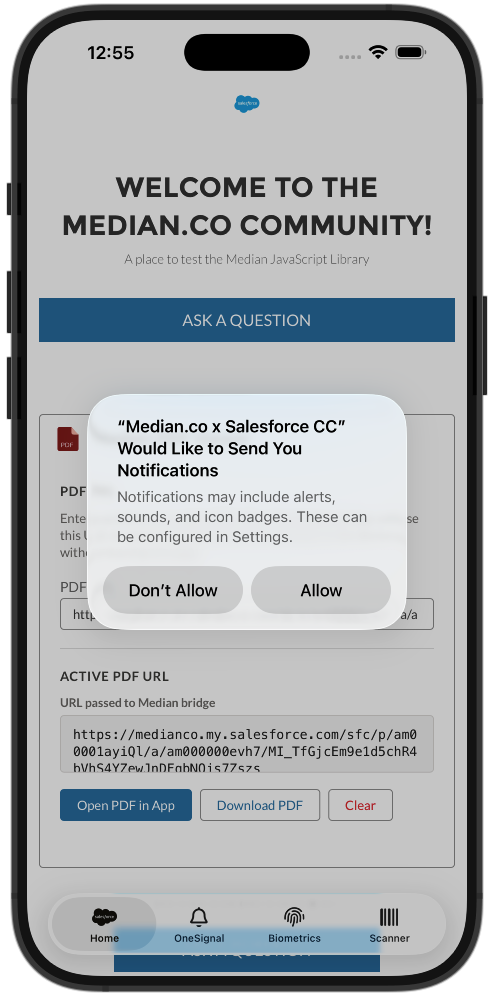
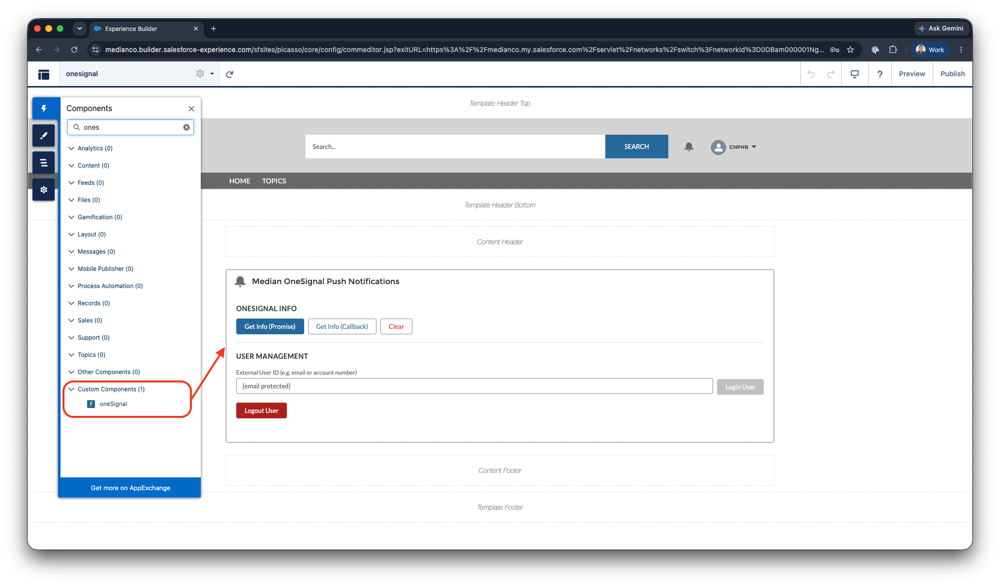
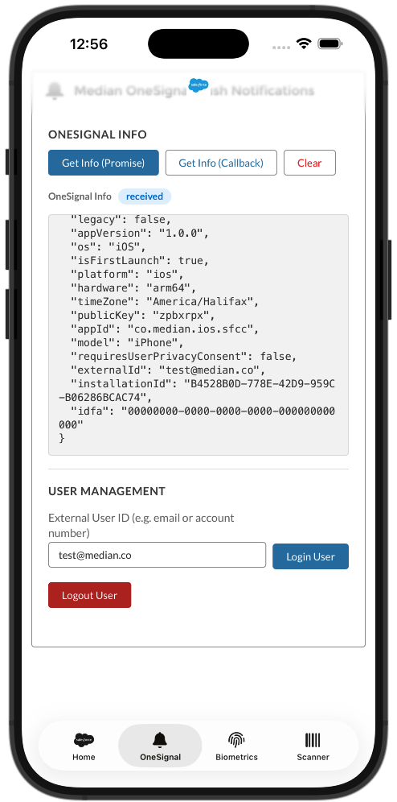
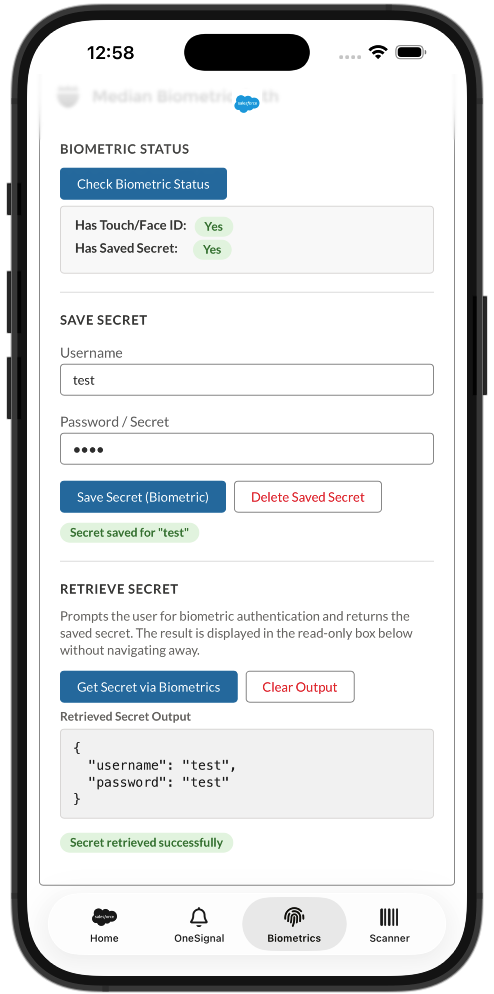

# Median × Salesforce LWC Components

A collection of open-source Lightning Web Components (LWC) that integrate [Median.co](https://median.co) native mobile features into Salesforce Experience Cloud and Lightning App pages.

> **These components are built for apps wrapped with Median.** Most features rely on the `window.median` JavaScript bridge that Median injects into the webview at runtime. Components will display an in-UI warning when loaded outside a Median app, and bridge-dependent buttons are automatically disabled.

<p align="center">
  
  <br>
  <em>Salesforce LWC app screenshot on iPhone 17 Pro Max</em>
</p>

## Table of Contents

- [LWC Example Components](#components)
- [Repository Structure](#repository-structure)
- [Prerequisites](#prerequisites)
- [Installation](#installation)
- [Component Reference](#component-reference)
  - [oneSignal](#oneSignal)
  - [biometricAuth](#biometricauth)
  - [qrScannerNative](#qrscannernative)
  - [pdfViewer](#pdfviewer)
- [Deployment Notes](#deployment-notes)
- [Resources](#resources)

## Median.co LWC Example Components

| Component         | Median Feature                            | Apex Required |
| ----------------- | ----------------------------------------- | ------------- |
| `oneSignal`       | Push notification info, user login/logout | No            |
| `biometricAuth`   | Biometric save / retrieve / delete secret | No            |
| `qrScannerNative` | QR code and barcode scanning              | No            |
| `pdfViewer`       | Open and download PDFs natively           | No            |

## Repository Structure

```
median-salesforce-lwc/
│
├── README.md
│
├── force-app/
│   └── main/
│       └── default/
│           └── lwc/
│               ├── oneSignal/
│               │   ├── oneSignal.html
│               │   ├── oneSignal.js
│               │   ├── oneSignal.css
│               │   └── oneSignal.js-meta.xml
│               │
│               ├── auth/
│               │   ├── auth.html
│               │   ├── auth.js
│               │   ├── auth.css
│               │   └── auth.js-meta.xml
│               │
│               ├── qrScannerNative/
│               │   ├── qrScannerNative.html
│               │   ├── qrScannerNative.js
│               │   ├── qrScannerNative.css
│               │   └── qrScannerNative.js-meta.xml
│               │
│               └── pdfViewer/
│                   ├── pdfViewer.html
│                   ├── pdfViewer.js
│                   ├── pdfViewer.css
│                   └── pdfViewer.js-meta.xml
│
├── docs/
│   └── assets/
│       ├── biometrics.png
│       ├── experience-builder.png
│       ├── onesignal-info.png
│       └── salesforce-demo-app.png
│
└── .forceignore
```

## Prerequisites

Before deploying these components you will need:

- A **Salesforce org** (Developer Edition, Sandbox, or Production) with Lightning Experience enabled.
- **Salesforce CLI** (`sf` / `sfdx`) installed — [installation guide](https://developer.salesforce.com/tools/salesforcecli).
- An **authenticated Salesforce org** connected to the CLI.
- A **Median account** with a Salesforce Experience Cloud URL configured as your app's starting URL — [Median documentation](https://docs.median.co).
- The relevant **Median plugins enabled** in your app configuration (OneSignal, FaceID/Touch ID & Android Biometrics, Barcode Scanner).

## Installation

### Option 1: Deploy with Salesforce CLI

1. Clone this repository:

   ```bash
   git clone [PLACEHOLDER: repository URL]
   cd median-salesforce-lwc
   ```

2. Authenticate with your org:

   ```bash
   sf org login web --alias my-org
   ```

3. Deploy all components:

   ```bash
   sf project deploy start --source-dir force-app --target-org my-org
   ```

4. Deploy a single component (optional):
   ```bash
   sf project deploy start --source-dir force-app/main/default/lwc/pdfViewer --target-org my-org
   ```

### Option 2: Manual copy

Copy the desired component folder from `force-app/main/default/lwc/` into your own Salesforce project's `lwc/` directory and deploy using your existing pipeline.

### Adding components to a page

1. In Salesforce Setup, open **Experience Builder** (for Experience Cloud) or the **Lightning App Builder** (for internal pages).
2. Drag the component from the component panel onto the page canvas.
3. Save and **Publish** the page.

<p align="center">
  
  <br>
  <em>Salesforce Experience Builder</em>
</p>

## Component Reference

### oneSignal

Integrates the [Median OneSignal plugin](https://median.co/plugins/onesignal) to manage push notification subscriptions directly from a Salesforce page.

<p align="center">
  
  <br>
  <em>OneSignal Info</em>
</p>

#### Features

- **Get OneSignal Info** — retrieves the device's OneSignal subscription state, player ID, and push token. Supports both the Promise and global-callback invocation patterns.
- **Login User** — associates the device with an external user ID (e.g. a Salesforce contact email or account number) so targeted push notifications can be sent to this user.
- **Logout User** — removes the external user ID association from the device.

#### Supported targets

| Target                | Supported |
| --------------------- | --------- |
| Experience Cloud Page | ✅        |
| Lightning App Page    | ✅        |
| Lightning Record Page | ✅        |

#### Median plugins required

- OneSignal plugin enabled in Median app config.
- A valid OneSignal App ID configured in Median.

#### Usage notes

- **Login User** requires a non-empty External User ID. This value is typically set from a Salesforce field (e.g. `{!Contact.Email}`) in a parent component or passed via `@api`.
- Both the Promise and Callback buttons call the same underlying `median.onesignal.info()` API — use whichever pattern fits your integration needs.
- Logout removes the external ID but does **not** unsubscribe the device from push entirely.

#### Median API methods used

```js
median.onesignal.info(); // Promise
median.onesignal.info({ callback: "fnName" }); // Callback
median.onesignal.login(externalUserId); // Promise
median.onesignal.logout(); // Promise
```

---

### biometricAuth

Integrates the [Median Auth plugin](https://median.dev/auth) to save and retrieve secrets (e.g. credentials) using the device's native biometric authentication (Face ID / Touch ID / Fingerprint).

<p align="center">
  
  <br>
  <em>Biometric Auth</em>
</p>

#### Features

- **Check Biometric Status** — checks whether the device supports biometrics and whether a secret is already stored.
- **Save Secret** — encodes a username and password as a JSON string and saves it to the iOS Keychain / Android Keystore. No biometric prompt is required to save.
- **Delete Saved Secret** — removes the stored secret from the device without a biometric prompt.
- **Retrieve Secret** — triggers a native biometric prompt. On success the secret is decrypted and displayed in a read-only output textbox on the same page, with no navigation or redirect.

#### Supported targets

| Target                | Supported |
| --------------------- | --------- |
| Experience Cloud Page | ✅        |
| Lightning App Page    | ✅        |
| Lightning Record Page | ✅        |

#### Median plugins required

- Auth plugin enabled in Median app config.

#### Usage notes

- Secrets are stored as a JSON string: `{ "username": "...", "password": "..." }`. If you want to store a different shape of data, modify the `saveSecret()` method in `biometricAuth.js`.
- Retrieval uses the **global callback pattern** (`window.median_auth_get_callback`) so the native layer can return data back into the LWC reactive state without a page reload.
- `minimumAndroidBiometric` is set to `'strong'` by default (Class 3 biometrics). Change this in `biometricAuth.js` if your target devices use Class 2 biometrics.
- If the device has no biometric hardware, the Save button is disabled after a status check confirms `hasTouchId: false`.

#### Median API methods used

```js
median.auth.status(); // Promise → { hasTouchId, hasSecret }
median.auth.save({ secret, minimumAndroidBiometric }); // Promise
median.auth.get({ callbackFunction: "fnName" }); // Callback → { success, secret, error }
median.auth.delete(); // Promise
```

---

### qrScannerNative

Integrates the [Median QR / Barcode Scanner](https://docs.median.co/docs/qr-barcode-scanner) to launch the device camera scanner and return the result directly into the page without navigating away.

#### Features

- **Set Custom Prompt** — updates the instructional text shown inside the native scanner UI at runtime using `median.barcode.setPrompt()`.
- **Scan via Promise** — launches the native scanner and `await`s the result. The full raw JSON response is displayed in a resizable output textbox.
- **Scan via Callback** — registers a global callback (`window.median_barcode_scan_callback`) and passes its name to the scanner, returning the result into LWC reactive state without a page reload.
- A **structured result card** breaks out the scanned `code` and barcode `type` beneath the raw output.
- A **loading spinner** is shown while the native scanner UI is open.

#### Supported targets

| Target                | Supported |
| --------------------- | --------- |
| Experience Cloud Page | ✅        |
| Lightning App Page    | ✅        |
| Lightning Record Page | ✅        |

#### Median plugins required

- Barcode / QR Scanner plugin enabled in Median app config.

#### Usage notes

- **Promise vs Callback** — both methods call the same native scanner. Use Promise for simpler code; use Callback if your Median app version or platform requires the explicit callback pattern.
- The raw output textarea is resizable, making it easy to inspect deeply nested scan payloads.
- On cancellation, the native scanner returns `{ success: false, error: 'cancelled' }` — this is handled gracefully with a status badge rather than an error.

#### Median API methods used

```js
median.barcode.setPrompt(promptText); // Synchronous
median.barcode.scan(); // Promise → { success, code, type, error }
median.barcode.scan({ callback: "fnName" }); // Callback
```

#### Scan result shape

```json
{
  "success": true,
  "code": "https://example.com",
  "type": "QR_CODE"
}
```

---

### pdfViewer

Opens and downloads PDFs natively inside a Median-wrapped app using a hardcoded public URL. No Apex, no file uploads, no page navigation required.

#### Features

- **Hardcoded default URL** — set `DEFAULT_PDF_URL` at the top of `pdfViewer.js` to pre-populate the URL field on load.
- **Runtime URL override** — an editable URL input lets you test different PDFs without redeploying.
- **Read-only URL display** — a dedicated textbox mirrors the active URL so it is always visible before triggering an action.
- **Open PDF in App** — navigates the webview to the PDF URL via `window.location.href`. The Median app intercepts the navigation and renders the document in the native PDF viewer (PDFKit on iOS, PDFViewer on Android). No bridge call required; works from any browser for URL validation.
- **Download PDF** — calls `median.share.downloadFile({ url, open: false })` to silently download the file to the device (Android: Downloads folder; iOS: native Share / Save to Files sheet).

#### Supported targets

| Target                | Supported |
| --------------------- | --------- |
| Experience Cloud Page | ✅        |
| Lightning App Page    | ✅        |
| Lightning Record Page | ✅        |

#### Median plugins required

- Download File plugin enabled in Median app config (required for the **Download** button only).
- No plugin required for the **Open** button — `window.location.href` is a standard webview navigation.

#### Configuration

Open `pdfViewer.js` and update the constant at the top of the file:

```js
// pdfViewer.js — line 4
const DEFAULT_PDF_URL = "https://your-domain.com/your-document.pdf";
```

The URL must be:

- Publicly accessible (no authentication wall), **or**
- A Salesforce content delivery URL that the Median webview session can reach.

#### Button behaviour by environment

| Button          | Inside Median app          | Desktop browser             |
| --------------- | -------------------------- | --------------------------- |
| Open PDF in App | ✅ Opens native PDF viewer | ✅ Navigates browser to PDF |
| Download PDF    | ✅ Downloads to device     | ❌ Disabled (bridge absent) |

#### Median API methods used

```js
window.location.href = url; // Open — no bridge needed
median.share.downloadFile({ url, open: false }); // Download
```

## Deployment Notes

### Org permissions

No special Salesforce permissions are required beyond the ability to deploy LWC metadata. There is no Apex in this repository.

### Experience Cloud (Community) pages

All four components are exposed to the `lightningCommunity__Page` and `lightningCommunity__Default` targets and will appear in the Experience Builder component panel after deployment.

### Median app configuration

Each component depends on one or more Median plugins being enabled in your app's configuration panel. Refer to the **Median plugins required** section for each component and confirm the plugins are active before testing.

| Plugin               | Where to enable                                           |
| -------------------- | --------------------------------------------------------- |
| OneSignal            | Median Dashboard → App Config → Plugins → OneSignal       |
| Auth (Biometrics)    | Median Dashboard → App Config → Plugins → Auth            |
| Barcode / QR Scanner | Median Dashboard → App Config → Plugins → Barcode Scanner |
| Download File        | Median Dashboard → App Config → Plugins → Download File   |

<!-- PLACEHOLDER: Replace the plugin panel paths above if the Median dashboard UI has changed -->

### Testing without a physical device

The Median JavaScript bridge (`window.median`) is only injected at runtime inside a Median-wrapped webview. When loading these components in a desktop browser or the Salesforce App Builder preview:

- An amber warning banner is shown at the top of each card.
- Buttons that require the bridge are automatically disabled.
- The **pdfViewer** Open button and **qrScannerNative** Set Prompt button are the only exceptions as these can be partially validated in a desktop browser.

For full end-to-end testing, load your Experience Cloud URL inside your Median app on a physical iOS or Android device or via virtual simulator in the Median.co App Studio.

### `window.median` vs `window.Median`

All components normalise both casing conventions through a shared accessor pattern:

```js
get _median() {
    return window.median || window.Median || null;
}
```

This stepo is optional but ensures compatibility across different Median JavaScript Library embeds (App or NPM).

## Resources

- [Median Documentation](https://docs.median.co)
- [Median Salesforce Documentation](https://docs.median.co/docs/salesforce)
- [Median Plugin Reference](https://docs.median.co/docs/plugins)
- [Salesforce LWC Developer Guide](https://developer.salesforce.com/docs/component-library/documentation/en/lwc)
- [Salesforce CLI Setup](https://developer.salesforce.com/tools/salesforcecli)
- [Experience Cloud Builder](https://help.salesforce.com/s/articleView?id=sf.community_designer_overview.htm)
- [Median Community Forum](https://docs.median.co/discussion)
